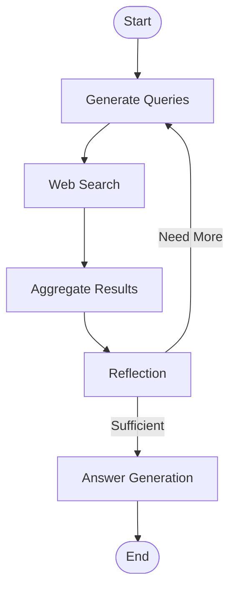

# Deep Research Agent

A sophisticated **LangGraph-powered** AI research agent with real-time streaming interface that conducts comprehensive research on any topic using advanced language models and web search capabilities.

## 🧠 LangGraph Architecture

This application leverages **LangGraph** - a framework for building stateful, multi-actor applications with LLMs. The research workflow is implemented as a directed graph with the following nodes:

### Research Workflow Graph


### LangGraph Features Used
- **StateGraph**: Manages research state across workflow steps
- **Parallel Execution**: Concurrent web searches using `Send` for optimal performance
- **Conditional Routing**: Dynamic decision-making based on research completeness
- **Native Streaming**: Real-time progress updates via `astream_events()`
- **State Management**: Comprehensive state tracking with `TypedDict` annotations
- **Error Handling**: Robust error handling and recovery mechanisms

## 🚀 Quick Start

```bash
# Install and start everything
npm install
npm start
```

The application will automatically:
1. Install frontend dependencies (React + TypeScript)
2. Install backend dependencies (Python + LangGraph)
3. Start the backend server (FastAPI on port 8000)
4. Start the frontend server (Vite on port 5173)
5. Open your browser to http://localhost:5173

## 🖥️ Frontend Capabilities

### Core Interface Features
- **Modern React + TypeScript**: Built with Vite for fast development
- **Responsive Design**: Works seamlessly on desktop and mobile devices
- **Real-time Research Interface**: Watch AI research unfold in real-time
- **Interactive Timeline**: Track progress through each research phase
- **Resizable Panels**: Customizable layout with draggable panel dividers

### Advanced UI Components
- **shadcn/ui Component Library**: Professional, accessible UI components
- **Dark/Light Mode**: Theme switching with system preference detection
- **Search Interface**: Clean, intuitive search input with suggestions
- **Results Panel**: Markdown-rendered research results with syntax highlighting
- **Activity Timeline**: Step-by-step progress visualization
- **Error Handling**: Graceful fallbacks and user-friendly error messages

### Theme System
- **Persistent Theme Settings**: Remembers user preference across sessions
- **System Theme Detection**: Automatically matches OS dark/light mode
- **Smooth Transitions**: Animated theme switching
- **Accessible Design**: High contrast ratios and keyboard navigation

## 📡 Event Streaming Capabilities

### Real-time Progress Updates
The frontend uses **Server-Sent Events (SSE)** to provide real-time updates during research:

```typescript
// SSE connection for real-time updates
const response = await fetch('/research/stream', {
  method: 'POST',
  headers: { 'Content-Type': 'application/json' },
  body: JSON.stringify({ 
    question: query, 
    stream_mode: 'events'  // Triggers LangGraph astream_events
  })
});
```

### Streaming Event Types
- **`node_start`**: When a research phase begins
- **`node_complete`**: When a research phase completes
- **`node_stream`**: Real-time progress within a phase
- **`complete`**: Final research results available
- **`error`**: Error handling with detailed messages

### Debug Mode
- **Live Event Monitoring**: View raw SSE events in real-time
- **Debug Panel**: Inspect LangGraph event payloads
- **Performance Metrics**: Track node execution times
- **Error Diagnostics**: Detailed error information for troubleshooting

### Connection Management
- **Automatic Fallback**: Switches to demo mode if backend unavailable
- **Connection Status**: Visual indicators for backend connectivity
- **Retry Logic**: Automatic reconnection attempts
- **Graceful Degradation**: Functional demo mode for development

## 🤖 LLM Models & Task Distribution

The application uses **multiple specialized LLM models** optimized for different research tasks:

### Model Configuration
```python
# Query Generation - Complex reasoning for search strategy
query_generator_model: "gpt-4o-mini-search-preview-2025-03-11"

# Web Search - Enhanced search capabilities with web browsing
web_searcher_model: "gpt-4o-search-preview"

# Reflection - Analysis and completeness evaluation
reflection_model: "o4-mini"

# Answer Generation - Comprehensive synthesis
answer_model: "o4-mini"
```

### Task-Specific Model Usage

#### 1. Query Generation (`gpt-4o-mini-search-preview`)
- **Purpose**: Breaks down complex questions into targeted search queries
- **Capabilities**: Advanced reasoning, query optimization, search strategy
- **Input**: User's original question
- **Output**: 2-4 focused search queries with rationale

#### 2. Web Search (`gpt-4o-search-preview`)
- **Purpose**: Executes web searches with real-time browsing capabilities
- **Capabilities**: Live web access, source evaluation, content extraction
- **Input**: Individual search queries
- **Output**: Comprehensive search results with sources

#### 3. Reflection (`o4-mini`)
- **Purpose**: Evaluates research completeness and identifies gaps
- **Capabilities**: Content analysis, gap identification, decision-making
- **Input**: Aggregated search results
- **Output**: Sufficiency assessment and follow-up queries

#### 4. Answer Generation (`o4-mini`)
- **Purpose**: Synthesizes final comprehensive answers
- **Capabilities**: Information synthesis, citation formatting, markdown generation
- **Input**: All research findings and sources
- **Output**: Well-structured answer with proper citations

### Model Performance Optimization
- **Parallel Processing**: Multiple web searches execute concurrently
- **Temperature Control**: Optimized settings for each model type
- **Context Management**: Efficient token usage across research phases
- **Error Handling**: Fallback strategies for model failures

## 🔧 Research Workflow Phases

### Phase 1: Query Generation
- Analyzes user question for key concepts
- Generates 2-4 targeted search queries
- Provides rationale for search strategy
- Optimizes for comprehensive coverage

### Phase 2: Web Search (Parallel)
- Executes multiple searches concurrently
- Uses OpenAI's web search capabilities
- Extracts relevant information and sources
- Evaluates source credibility

### Phase 3: Result Aggregation
- Combines search results from all queries
- Removes duplicates and conflicts
- Organizes information by relevance
- Prepares data for analysis

### Phase 4: Reflection & Analysis
- Evaluates research completeness
- Identifies information gaps
- Determines if additional research needed
- Generates follow-up queries if necessary

### Phase 5: Answer Generation
- Synthesizes comprehensive final answer
- Formats with proper citations
- Structures information logically
- Provides markdown formatting

## 🛠️ Development & Configuration

### Environment Setup
```bash
# Frontend development
npm run dev:frontend

# Backend development
npm run dev:backend

# LangGraph development UI
npm run langgraph:dev
```

### Configuration Options
```python
# Research parameters
initial_queries_count: 3          # Number of initial search queries
max_research_loops: 2             # Maximum research iterations
max_sources_per_query: 10         # Sources per search query
min_sources_for_sufficiency: 5    # Minimum sources for completion
```

### API Endpoints
- **POST `/research/stream`**: Real-time research with SSE
- **WS `/research/ws`**: WebSocket alternative for streaming
- **GET `/health`**: Backend health check
- **GET `/docs`**: Interactive API documentation

## 📊 Monitoring & Observability

### LangSmith Integration
```bash
# Environment variables for tracing
LANGSMITH_TRACING=true
LANGSMITH_PROJECT="deep-research-agent"
LANGSMITH_API_KEY="your-api-key"
```

### Performance Metrics
- **Research Duration**: Total time per research session
- **Model Usage**: Token consumption per model
- **Success Rate**: Completion rate and error tracking
- **Source Quality**: Citation accuracy and relevance

### Debug Features
- **Step-by-step Logging**: Detailed execution traces
- **State Inspection**: Real-time state monitoring
- **Error Diagnostics**: Comprehensive error reporting
- **Performance Profiling**: Execution time analysis

## 🚀 Deployment Options

### Local Development
```bash
npm start                    # Full stack development
npm run dev:frontend        # Frontend only
npm run dev:backend         # Backend only
```

### Docker Deployment
```bash
docker-compose up -d        # Production deployment
docker-compose logs -f      # View logs
```

### Cloud Deployment
- **Railway**: Automatic deployment from GitHub
- **Render**: Multi-service deployment
- **Vercel**: Frontend deployment
- **DigitalOcean**: Full-stack VPS deployment

## 🔍 Advanced Features

### Research Loops
- **Iterative Research**: Continues until sufficient information gathered
- **Gap Analysis**: Identifies missing information automatically
- **Quality Thresholds**: Configurable sufficiency criteria
- **Loop Limits**: Prevents infinite research cycles

### Citation System
- **Automatic Citations**: Proper source attribution
- **URL Validation**: Verifies source accessibility
- **Citation Formatting**: Consistent citation style
- **Source Ranking**: Prioritizes authoritative sources

### Error Recovery
- **Graceful Degradation**: Continues research despite partial failures
- **Retry Logic**: Automatic retry for transient errors
- **Fallback Modes**: Demo mode when backend unavailable
- **User Feedback**: Clear error messages and recovery options

## 📚 Documentation

- **API Documentation**: http://localhost:8000/docs (when running)
- **Setup Guide**: [SETUP.md](SETUP.md)
- **Deployment Guide**: [DEPLOYMENT.md](DEPLOYMENT.md)
- **LangGraph Improvements**: [LANGGRAPH_IMPROVEMENTS.md](LANGGRAPH_IMPROVEMENTS.md)

## 🤝 Contributing

1. Fork the repository
2. Create a feature branch
3. Make your changes
4. Test thoroughly
5. Submit a pull request

## 📄 License

MIT License - see [LICENSE](LICENSE) for details.

---

**Built with LangGraph** - The next generation of AI application development