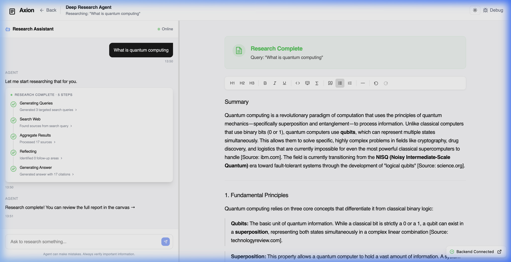
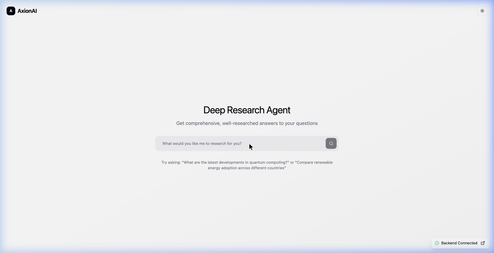

<div align="center">

# 🔬 Deep Research Agent

**An AI-powered research engine that thinks before it answers.**

Built on LangGraph's stateful graph architecture, this agent doesn't just search — it plans, searches in parallel, reflects on gaps, and loops until it has enough evidence to write a comprehensive, cited report. Results appear in a rich WYSIWYG document editor you can edit, refine, and ask the AI to rewrite inline.

[](https://www.langchain.com/langgraph)
[](https://fastapi.tiangolo.com/)
[](https://react.dev/)
[](https://www.typescriptlang.org/)
[](https://tiptap.dev/)

</div>

---

## 📸 Screenshots

### Live Research + WYSIWYG Canvas


*Research results appear in TipTap's rich text editor — always formatted, always editable. The toolbar provides heading levels, bold/italic/underline, code blocks, equations, blockquotes, lists, undo/redo and more.*

### Landing Page


*Clean search interface — just ask a question.*

---

## 🧠 Reasoning Framework: LangGraph StateGraph

The core of this project is a **stateful directed graph** built with [LangGraph](https://www.langchain.com/langgraph) that implements the **Reflexion / Self-Critique** reasoning framework — a pattern where the model generates an initial output, reflects on its own gaps and mistakes, and iteratively improves it before delivering a final answer.

### The Research Graph

```
START
  │
  ▼
┌─────────────────────┐
│   Generate Queries   │  ← gpt-4o-mini-search-preview
│  Break the question  │    Plans 2–4 targeted search queries
│  into sub-topics     │    with explicit rationale
└──────────┬──────────┘
           │  (Send API — fan out in parallel)
           ▼
┌─────────────────────┐
│     Web Search       │  ← gpt-4o-search-preview (×N parallel)
│  Real-time browsing  │    Live internet access per query
│  per search query    │    Source credibility evaluation
└──────────┬──────────┘
           │
           ▼
┌─────────────────────┐
│  Aggregate Results   │
│  Deduplicate, merge  │
│  rank by relevance   │
└──────────┬──────────┘
           │
           ▼
┌─────────────────────┐
│     Reflection       │  ← o4-mini
│  "Do I know enough?" │    Identifies knowledge gaps
│  Evaluates coverage  │    Decides: answer or loop?
└──────────┬──────────┘
           │
    ┌──────┴────────────────────────┐
    │ Sufficient?                   │ Need more?
    ▼                               ▼
┌──────────────────┐       Back to Generate Queries
│ Answer Generation │  ← o4-mini       (max 2 loops)
│ Synthesize report │
│ with citations    │
└────────┬─────────┘
         │
        END
```

### Why This Matters

Most RAG pipelines retrieve once and answer immediately. This agent uses a **Reflect → Loop** pattern:

| Approach | Retrieve | Reflect | Loop |
|---|---|---|---|
| Naive RAG | ✅ | ❌ | ❌ |
| This Agent | ✅ | ✅ | ✅ (up to 2×) |

The `reflection` node — powered by `o4-mini` — acts as the agent's inner monologue. It reads all gathered sources, identifies what's still missing or uncertain, and either generates follow-up queries (sending the graph back to `generate_queries`) or declares the research sufficient and moves to answer synthesis.

### Reasoning Pattern: Reflexion / Self-Critique

> **Reflexion** is an agentic framework where the model generates an initial output, evaluates it against a goal, reflects on its own shortcomings, and refines — repeating until the output is deemed sufficient.
>
> `Draft → Evaluate → Reflect → Refine`

This agent maps that cycle directly onto LangGraph nodes:

| Reflexion Stage | LangGraph Node | Model |
|---|---|---|
| **Draft** | `generate_queries` + `web_search` | gpt-4o-search-preview |
| **Evaluate** | `aggregate_results` | — |
| **Reflect** | `reflection` — *"Do I know enough?"* | o4-mini |
| **Refine** | Loop → `generate_queries` (up to 2×) | — |
| **Final Output** | `answer_generation` | o4-mini |

Most RAG pipelines retrieve once and answer immediately. Here, the `reflection` node — powered by `o4-mini` — acts as the agent's inner monologue: it reads all gathered sources, identifies knowledge gaps, and either triggers another research loop or declares the evidence sufficient and proceeds to answer synthesis.

| Approach | Retrieve | Reflect | Self-Critique Loop |
|---|---|---|---|
| Naive RAG | ✅ | ❌ | ❌ |
| **This Agent** | ✅ | ✅ | ✅ **(up to 2×)** |

### LangGraph Primitives Used

| Primitive | Purpose |
|---|---|
| `StateGraph` | Shared `OverallState` TypedDict passed and mutated between nodes |
| `Send` API | Fan-out: execute N web searches **in parallel** across query list |
| Conditional edges | `reflection` node dynamically routes — loop or proceed to answer |
| `astream_events()` | Node-level streaming → SSE → real-time frontend timeline |

---

## 🏗️ System Architecture

```
┌────────────────────────────────────────────────────────────┐
│                        Browser (React + TS)                │
│                                                            │
│   ┌──────────────────┐          ┌───────────────────────┐  │
│   │   Chat Panel     │          │    Canvas Panel        │  │
│   │  (Activity feed) │          │  (TipTap WYSIWYG)      │  │
│   │  Step timeline   │          │  Formatting Toolbar    │  │
│   │  AI chat bubbles │          │  AI inline edit (SSE)  │  │
│   └────────┬─────────┘          └──────────┬────────────┘  │
│            │ SSE / fetch                   │                │
└────────────┼───────────────────────────────┼───────────────┘
             │                               │
             ▼                               ▼
┌────────────────────────────────────────────────────────────┐
│                   FastAPI Backend (Python)                  │
│                                                            │
│   POST /research/stream   →   LangGraph StateGraph         │
│   POST /edit              →   GPT-4o inline document edit  │
│   GET  /health            →   Status check                 │
│                                                            │
│   LangGraph astream_events() → SSE frames → Frontend       │
└────────────────────────────────────────────────────────────┘
```

### Real-Time Streaming Pipeline

The backend uses LangGraph's **native `astream_events()`** to stream fine-grained events as the graph executes. Each node emits structured SSE frames that the frontend maps to timeline steps:

```
LangGraph node executes
        │
   astream_events()
        │
   on_chain_start  →  { type: "node_start",    nodeId: "generate_queries" }
   on_chain_end    →  { type: "node_complete",  nodeId: "generate_queries", duration: 4857 }
   on_chain_stream →  { type: "node_stream",    ... }
        │
   FastAPI SSE endpoint  ──→  Server-Sent Events  ──→  React EventSource
        │
   Timeline UI updates in real-time
```

---

## ✨ Key Features

### Research Engine
- **Iterative Research Loops** — Reflects on completeness and searches again if needed (up to 2 loops)
- **Parallel Web Search** — Multiple queries execute concurrently via LangGraph `Send`
- **Specialized Models** — Different OpenAI models per task (mini for speed, o4 for reasoning)
- **Automatic Citations** — Every claim is sourced and formatted in the final report
- **Real-time Progress** — Watch every step of the graph execute as it happens

### WYSIWYG Document Editor
- **Always Rich** — No "Preview / Edit" toggle; formatting is always visible
- **Live Markdown Shortcuts** — Type `# ` → H1, `**text**` → bold, `> ` → blockquote
- **Formatting Toolbar** — H1–H3, Bold, Italic, Underline, Inline Code, Code Block, Equation (∑), Blockquote, Bullet List, Ordered List, Horizontal Rule, Undo/Redo
- **AI Inline Edit** — Select any text → floating toolbar → type an instruction → AI rewrites that section

### Interface
- **Resizable Panels** — Drag the divider between chat and canvas
- **Dark / Light Mode** — System preference detection + manual toggle
- **Debug Mode** — Inspect raw LangGraph event payloads in real-time
- **LangSmith Tracing** — Full observability of every graph execution

---

## 🤖 Model Allocation

| Task | Model | Why |
|---|---|---|
| Query Generation | `gpt-4o-mini-search-preview` | Fast reasoning for search strategy |
| Web Search | `gpt-4o-search-preview` | Real-time internet access |
| Reflection | `o4-mini` | Deep analytical reasoning for gap identification |
| Answer Synthesis | `o4-mini` | Thorough synthesis + citation formatting |
| Inline Document Edit | `gpt-4o` | Precision surgical edits to selected text |

---

## 🛠️ Tech Stack

**Backend**
- Python · FastAPI · LangGraph · LangChain · LangSmith
- OpenAI API (GPT-4o, o4-mini, search-preview variants)
- Uvicorn · Server-Sent Events (SSE) · WebSocket

**Frontend**
- React 18 · TypeScript · Vite
- TipTap (ProseMirror-based WYSIWYG editor)
- `react-resizable-panels` · shadcn/ui · Lucide icons

**Infrastructure**
- Docker · Docker Compose
- Railway · Render · Vercel compatible
- Nginx (production frontend serving)

---

## 🚀 Quick Start

```bash
# 1. Clone
git clone <your-repo-url>
cd Deep-Research-Agent-Interface

# 2. Set up environment variables
cp .env.example .env
# Add your OPENAI_API_KEY to .env

# 3. Install frontend dependencies
npm install

# 4. Set up Python backend
python3 -m venv venv
./venv/bin/pip install -r backend/requirements.txt

# 5. Start both servers
npm start                      # Frontend → http://localhost:5173
cd backend && ../venv/bin/python -m uvicorn api:app --reload --port 8000
```

| Service | URL |
|---|---|
| Frontend | http://localhost:5173 |
| Backend API | http://localhost:8000 |
| API Docs | http://localhost:8000/docs |

### Environment Variables

```bash
OPENAI_API_KEY=sk-...          # Required
LANGSMITH_TRACING=true         # Optional — enables LangSmith tracing
LANGSMITH_API_KEY=...          # Optional
LANGSMITH_PROJECT=deep-research-agent
```

### Research Parameters (configurable in `backend/config.py`)

```python
initial_queries_count = 3      # How many search queries to generate
max_research_loops    = 2      # Max reflection → re-search cycles
max_sources_per_query = 10     # Sources retained per web search
min_sources_for_sufficiency = 5  # Threshold to skip extra loops
```

---

## 📁 Project Structure

```
├── backend/
│   ├── api.py           # FastAPI app, SSE & WebSocket endpoints
│   ├── workflow.py      # LangGraph StateGraph definition
│   ├── nodes.py         # Individual graph node implementations
│   ├── state.py         # OverallState TypedDict
│   ├── streaming.py     # SSE streaming utilities
│   ├── prompts.py       # System prompts per model/node
│   └── config.py        # Research parameters
│
├── components/
│   ├── ResearchInterface.tsx   # Root: manages SSE, state, chat
│   ├── CanvasPanel.tsx         # Canvas with WYSIWYG editor
│   ├── RichTextEditor.tsx      # TipTap editor + bidirectional markdown
│   ├── EditorToolbar.tsx       # Formatting toolbar
│   ├── SelectionToolbar.tsx    # AI inline edit toolbar (on text select)
│   ├── ChatPanel.tsx           # Left-side agent chat feed
│   └── ActivityTimeline.tsx    # Research step progress cards
│
├── utils/
│   ├── markdownToHtml.ts       # Markdown → HTML for TipTap initial load
│   └── htmlToMarkdown.ts       # ProseMirror JSON → Markdown for AI APIs
│
└── services/
    └── researchApi.ts          # API client abstractions
```

---

## 🔭 How It Compares

| | Perplexity | ChatGPT Search | This Agent |
|---|---|---|---|
| Iterative research loops | ❌ | ❌ | ✅ |
| Parallel web searches | ❌ | ❌ | ✅ |
| Explicit reflection step | ❌ | ❌ | ✅ |
| Editable live document | ❌ | ❌ | ✅ |
| AI inline edit | ❌ | ❌ | ✅ |
| Real-time step visibility | ❌ | ❌ | ✅ |
| Open source / self-hosted | ❌ | ❌ | ✅ |

---

## 📄 License

MIT — free to use, modify, and deploy.

---

<div align="center">
  <sub>Built with LangGraph · FastAPI · React · TipTap</sub>
</div>